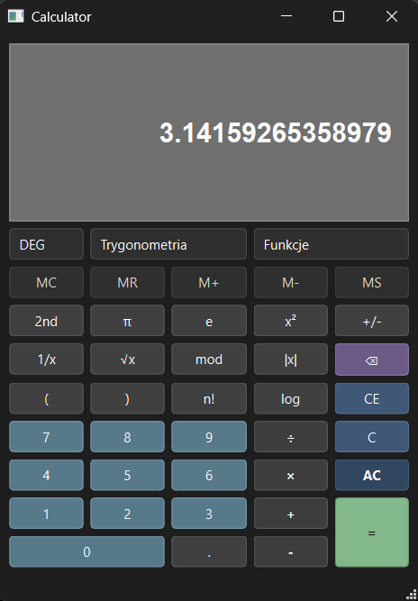
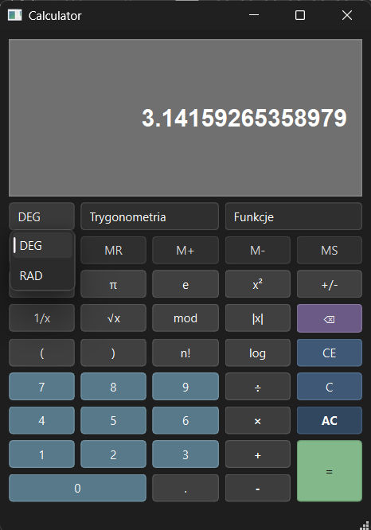
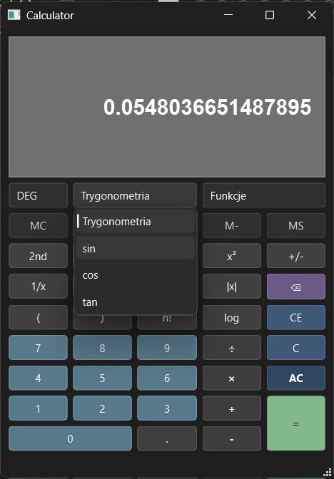
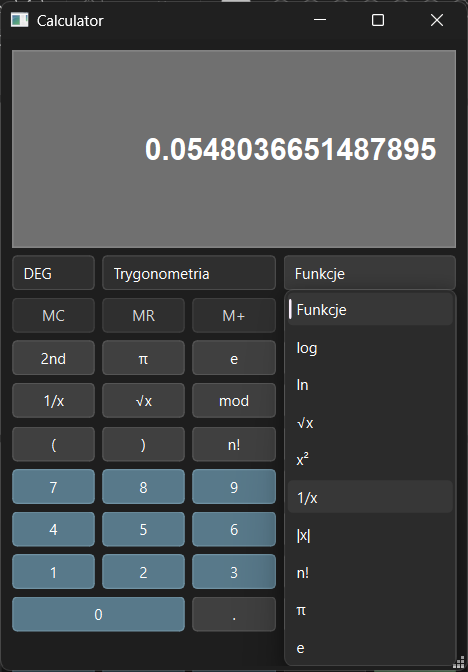

# 🧮 Qt Scientific Calculator

<p align="center">
  <strong>Desktop scientific calculator built with C++ and Qt Widgets.</strong>
</p>

<p align="center">
  
  
  
  
  
</p>

<p align="center">
  
</p>

---

## 📚 Table of Contents

- [Overview](#overview)
- [Features](#features)
- [Screenshots](#screenshots)
- [Tech Stack](#tech-stack)
- [Requirements](#requirements)
- [Getting Started](#getting-started)
- [Project Structure](#project-structure)
- [What I Learned](#what-i-learned)
- [Future Improvements](#future-improvements)
- [Author](#author)

---

<a id="overview"></a>
## 📌 Overview

**Qt Scientific Calculator** is a desktop calculator application built with **C++**, **Qt Widgets** and **CMake**.

The project supports standard arithmetic operations, scientific functions, constants, memory operations and expression evaluation with parentheses.  
It was created to practice desktop GUI development, custom application logic, input validation and CMake-based Qt project configuration.

The main focus of the project was not only creating a calculator interface, but also implementing a simple custom expression parser that handles operator precedence, brackets and common calculation errors.

---

<a id="features"></a>
## ✨ Features

### 🔢 Basic Operations
- addition, subtraction, multiplication and division
- decimal numbers
- sign change
- modulo operation
- parentheses support
- automatic handling of incomplete expressions

### 🧠 Scientific Functions
- square root
- power of two
- reciprocal value
- absolute value
- factorial
- base-10 logarithm
- natural logarithm
- constants: π and e

### 📐 Trigonometry
- sine
- cosine
- tangent
- degree/radian angle mode selector

### 💾 Memory Operations
- memory clear
- memory recall
- memory add
- memory subtract
- memory store

### 🛡️ Error Handling
- division by zero protection
- modulo by zero protection
- invalid square root protection
- invalid logarithm protection
- factorial validation for non-integer and negative values
- readable error messages in the status bar

---

<a id="screenshots"></a>
## 📸 Screenshots

| Main View | Angle Mode |
|---|---|
|  |  |

| Trigonometry Menu | Functions Menu |
|---|---|
|  |  |

---

<a id="tech-stack"></a>
## 🛠️ Tech Stack

| Area | Technology |
|---|---|
| Language | C++ |
| GUI Framework | Qt 6 / Qt Widgets |
| UI Design | Qt Designer `.ui` file |
| Build System | CMake |
| Application Type | Desktop GUI application |
| Platform | Windows / Desktop |

---

<a id="requirements"></a>
## ⚙️ Requirements

To build and run the project locally, you need:

- Qt 6.5 or newer
- CMake 3.19 or newer
- C++ compiler compatible with Qt
- Qt Creator or another C++ IDE
- Windows, Linux or macOS desktop environment

---

<a id="getting-started"></a>
## 🚀 Getting Started

### 1. Clone the repository

```bash
git clone https://github.com/YOUR_USERNAME/Qt-Scientific-Calculator.git
cd Qt-Scientific-Calculator
```

2. Configure the project
```
cmake -S . -B build
```
4. Build the project
```
cmake --build build
```
6. Run the application  

After building, run the generated executable from the build directory.  
You can also open the project in Qt Creator and build it directly from the IDE.  

---

<a id="project-structure"></a>

## 📁 Project Structure
```
Qt-Scientific-Calculator/
├── screenshots/
│   ├── angle-mode.png
│   ├── functions-menu.png
│   ├── overview.png
│   └── trigonometry-menu.png
├── .gitignore
├── CMakeLists.txt
├── LICENSE
├── README.md
├── calculator.cpp
├── calculator.h
├── calculator.ui
└── main.cpp
```

---

<a id="what-i-learned"></a>

## 🧠 What I Learned

This project helped me practice:  
- building desktop applications with Qt Widgets
- designing user interfaces with Qt Designer
- connecting UI elements with C++ logic using signals and slots
- organizing a Qt project with CMake
- implementing a custom expression parser
- handling operator precedence
- validating user input
- managing calculator memory state
- displaying user-friendly error messages
- creating a clean dark desktop UI

---

<a id="future-improvements"></a>

## 🚧 Future Improvements

- implement full 2nd function mode
- add keyboard input support
- add calculation history
- add more scientific functions
- improve responsive layout behavior
- add unit tests for expression parsing
- add application icon and Windows installer
- move UI text fully to English

---

<a id="author"></a>

## 👩‍💻 Author

Created by Katarzyna Stańczyk.
